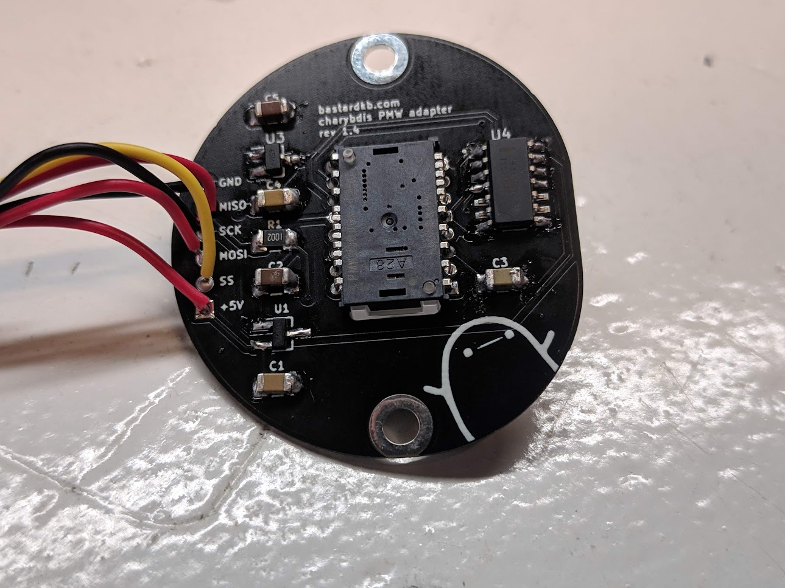
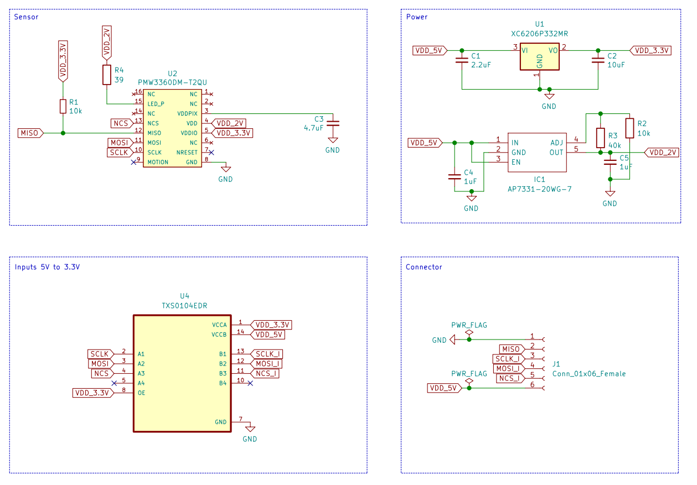

# PMW3360 sensor PCB

A PCB for the PMW3360 sensor. Designed for the Charybdis keyboard, can be used in other projects.

## Features

- Uses a 2.54mm spaced tht connector
- components chosen to be easy to handsolder
- M3 screw holes
- potato 

# BOM

| Designator | Name              | Amount |
| ---------- | ----------------- | ------ |
| C1         | 2.2uF             | 1      |
| C2         | 10uF              | 1      |
| C3         | 4.7uF             | 1      |
| C4, C5     | 1uF               | 2      |
| IC1*       | AP7331-20WG-7     | 1      |
| J1         | Conn_01x06_Female | 1      |
| R1, R2*    | 10k               | 2      |
| R3*        | 40k               | 1      |
| R4         | 39                | 1      |
| U1         | XC6206P332MR      | 1      |
| U2         | PMW3360DM-T2QU    | 1      |
| U4         | TXS0104EDR        | 1      |

(*) If you get a fixed 2.0V AP7331, you don't need R2 and R3. 

If you get an adjustable one, you need the resistors to set the output voltage.

All components on 1206 package.

# Schematic

# License
This work is licensed under a Creative Commons Attribution-NonCommercial-ShareAlike 4.0 International License.
